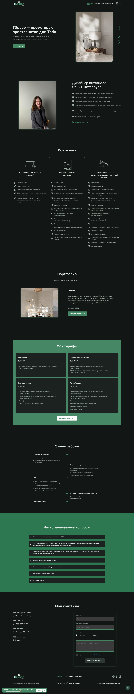
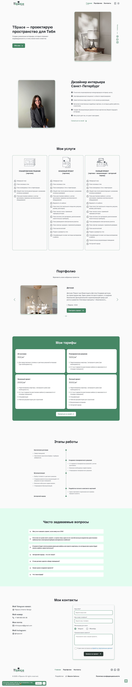

# ✨ Современное веб-приложение, созданное специально для дизайнера интерьеров.

## 📌 Цель проекта

Представить профессионализм дизайнера в онлайн-пространстве через портфолио реализованных проектов.  
Приложение помогает пользователям, ищущим вдохновение и услуги по оформлению интерьера, найти стиль, понять подход дизайнера и связаться с ним напрямую.

## 💡 Основной функционал

- **Галерея проектов:** Качественные изображения интерьеров с кратким описанием.
- **Форма обратной связи:** Связь с дизайнером через сайт.
- **Адаптивный дизайн:** Удобно смотреть с телефона, планшета или компьютера.

## 🛠️ Стек технологий

- **Frontend:** React / Vite / SCSS
- **State Management:** Redux
- **Backend (опционально):** Node.js / Express / MongoDB

📸 Скриншоты

### 🌙 Тёмная тема

### ☀️ Светлая тема

🧑‍🎨 Автор проекта
Максим — разработчик веб-приложений, специализирующийся на интерфейсах для креативных специалистов.

📬 Связь
Если у вас есть предложения или вопросы — [напишите здесь](https://t.me/MaksSafonov)
